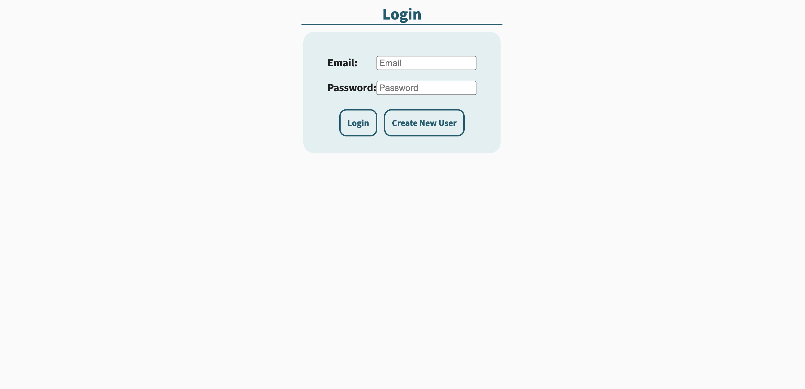

# medtrackr

<code></code>

This project is meant to help people who currently take a lot of medications. It allows users to log and organize their medications, and builds a custom weekly schedule that lists every medication and when to take each medication. 

## Login / Registration functionality

<code></code>

Users have the ability to register a new account or login to an already existing account. A postgreSQL database is used to consistently store the user's data.

## Add / Remove medication functionality

<code></code>
Users can add or remove medications. They simply need to enter the name of the medication, select how often the medication is to be taken, and then select add medication. The newly added medication will populate on the right. To remove, simply click the remove button next to the medication you choose to remove. 

## View an organized weekly medicatio calendar

<code></code>

medtrackr will use the data your custom medication schedule data to display a weekly schedule so you can keep track of which medications to take each day. 
